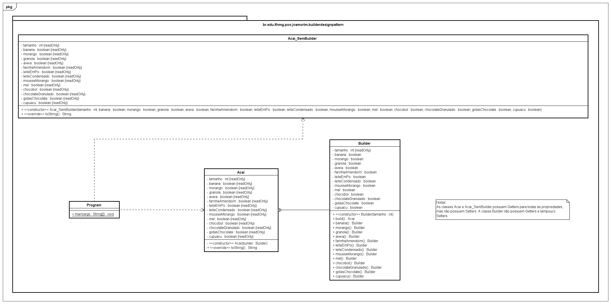

# Builder (Design Pattern)

Projeto simples que exemplifica a utilização do padrão de projeto Builder em código Java. O código deste repositório foi criado para ser utilizado em o vídeo: Design Patterns: Padrão de Projeto Builder em Java, que pode ser acessado [clicando aqui](). Mais explicações a respeito de Design Patterns e do Builder podem ser encontradas em um PDF que produzi enquanto pesquisava informações para esse vídeo. Você pode acessar o PDF, [clicando aqui]().

Modelo de Classes do projeto:

---

*O projeto, vídeo e PDF foram produzidos para a disciplina de Programação Orientada a Objetos (Ciência da Computação - IFNMG).*